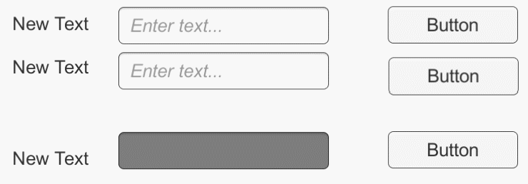

# Unity-Localize

## 소개

언어 설정/변경 기능 코드 패키지입니다.

언어 별 text, font\(optional\) data\(interface\) 를 manager에 add하면

OnEnable, OnChangeLanguage시 text component의 text 및 font가 update됩니다. 

## 주요 기능

* 언어 별 text 변경 지원
  * text, text format wit param 지원
* 언어 별 font 변경 지원 \(optional\)
* 데이터 클래스 형식은 interface 구현
  * interface만 구현되면 csv, json 등 자유로운 데이터 포멧 지원 가능

## 설치 

Unity Editor/상단 Window 탭/Package Manager/+ 버튼/‌

Add package from git URL 클릭 후‌

이 저장소의 URL 입력‌

​[`https://github.com/unity-korea-community/unity-localize.git`](https://github.com/unity-korea-community/unity-builder.git)

